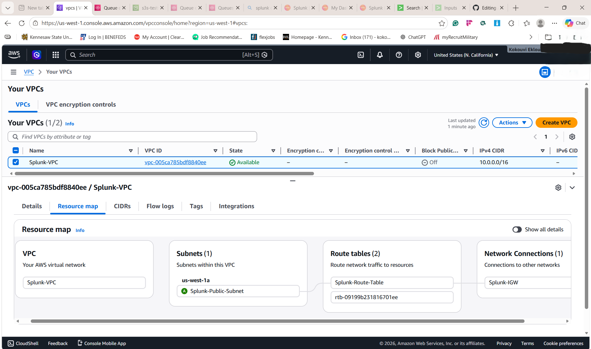
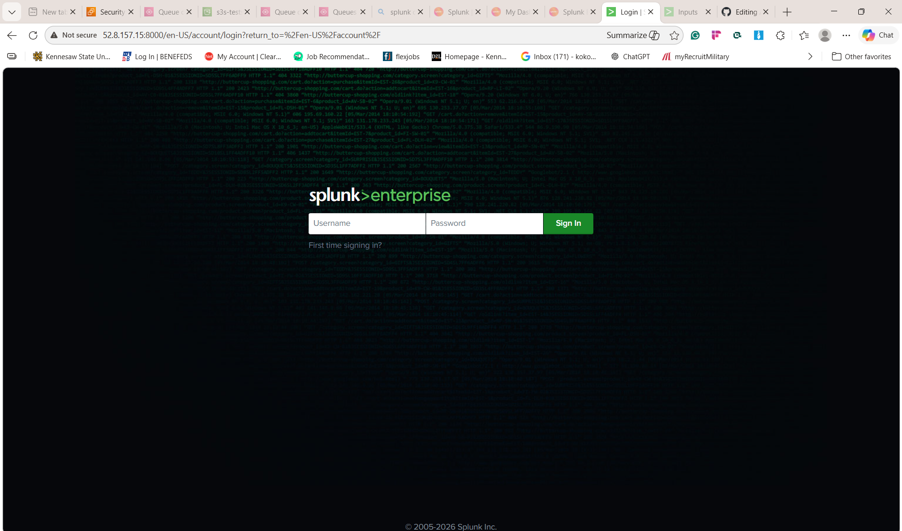
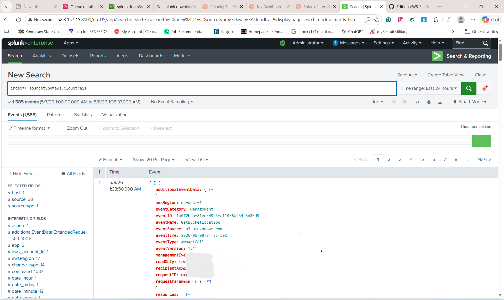
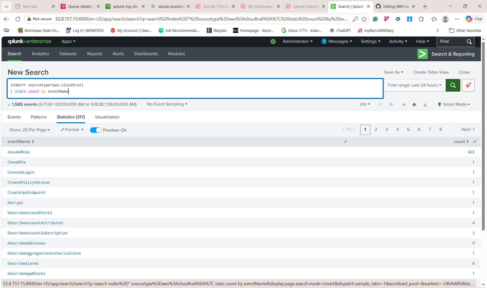
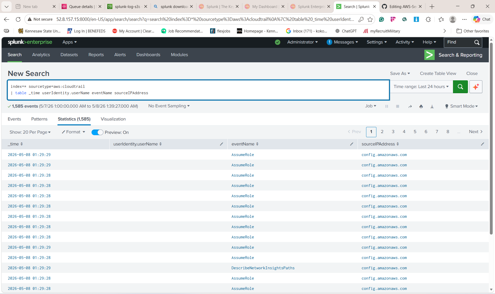
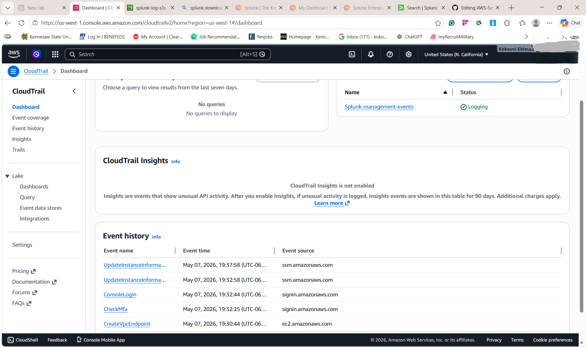
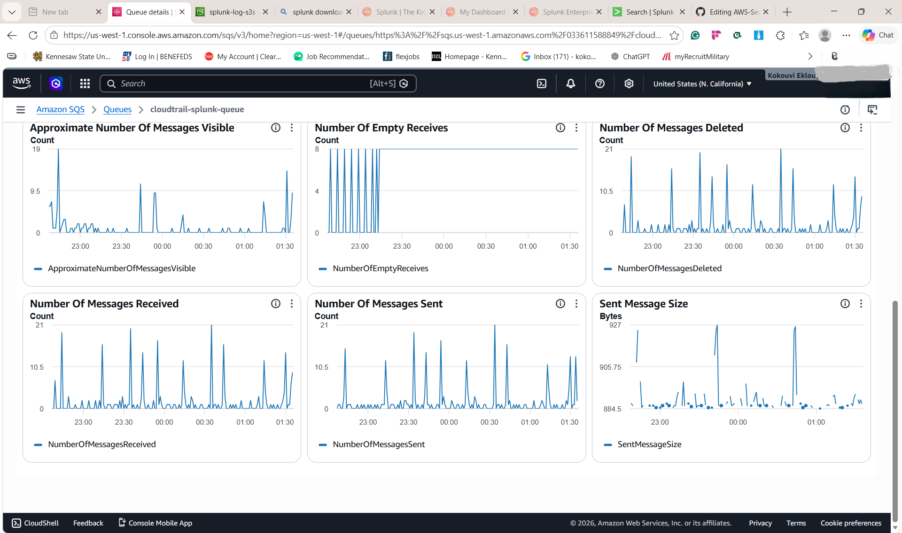

# AWS-Security-Monitoring-Pipeline-with-Splunk-Enterprise


# AWS Security Monitoring Pipeline with Splunk Enterprise

## Overview

This project demonstrates the design and implementation of a cloud-native security monitoring pipeline using AWS and Splunk Enterprise. The environment centralizes AWS API activity logs generated by CloudTrail, stores them in Amazon S3, forwards event notifications through Amazon SQS, and ingests security telemetry into Splunk Enterprise for monitoring, analysis, and investigation.

The project simulates foundational SOC and SIEM engineering workflows commonly used in enterprise cloud environments and demonstrates practical experience with AWS infrastructure, cloud networking, SIEM deployment, and security telemetry ingestion.

---

# Objectives

* Deploy Splunk Enterprise on AWS EC2
* Design and configure a custom AWS VPC
* Configure centralized AWS logging with CloudTrail
* Build an event-driven ingestion pipeline using S3 and SQS
* Integrate AWS telemetry into Splunk Enterprise
* Analyze AWS activity logs in Splunk
* Demonstrate foundational cloud security monitoring workflows

---

# Solution Architecture

```text id="3b8n1s"
AWS CloudTrail
        ↓
Amazon S3 Bucket
        ↓
S3 Event Notifications
        ↓
Amazon SQS Queue
        ↓
Splunk Add-on for AWS
        ↓
Splunk Enterprise
        ↓
Security Monitoring & Analysis
```

---

# Network Architecture

```text id="xltv4r"
Internet
    ↓
Internet Gateway
    ↓
Public Route Table
    ↓
Public Subnet
    ↓
EC2 Splunk Server
    ↓
Elastic IP
```

---

# Technologies Used

| Technology            | Purpose                        |
| --------------------- | ------------------------------ |
| AWS EC2               | Hosting Splunk Enterprise      |
| AWS VPC               | Isolated cloud networking      |
| Internet Gateway      | Public internet connectivity   |
| Route Tables          | Traffic routing                |
| Security Groups       | Network access control         |
| Elastic IP            | Persistent public addressing   |
| AWS CloudTrail        | AWS API activity logging       |
| Amazon S3             | Centralized log storage        |
| Amazon SQS            | Event-driven queueing          |
| Splunk Enterprise     | SIEM and security analytics    |
| Splunk Add-on for AWS | AWS telemetry ingestion        |
| AWS IAM               | Identity and access management |

---

# Skills Demonstrated

* SIEM deployment and administration
* AWS infrastructure deployment
* Cloud networking and routing
* Event-driven security log ingestion
* IAM policy configuration
* Security telemetry analysis
* Cloud operations and troubleshooting

---

# Environment Details

| Component         | Configuration          |
| ----------------- | ---------------------- |
| Operating System  | Ubuntu Server 26.04    |
| Splunk Version    | Splunk Enterprise 10.x |
| AWS Region        | us-west-1              |
| EC2 Instance Type | t3.xlarge              |
| Storage           | 100 GB gp3             |

---

# AWS Infrastructure Deployment

## 1. Create Custom VPC

A dedicated VPC was created to isolate the security monitoring environment.

| Setting    | Value         |
| ---------- | ------------- |
| Name       | `Splunk-VPC`  |
| CIDR Block | `10.0.0.0/16` |

---

## 2. Create Public Subnet

A public subnet was configured to host the Splunk EC2 instance.

| Setting                 | Value               |
| ----------------------- | ------------------- |
| Name                    | `soc-public-subnet` |
| CIDR Block              | `10.0.0.0/24`       |
| Availability Zone       | `us-west-1a`        |
| Auto-assign Public IPv4 | Disabled            |


---

## 3. Configure Internet Connectivity

An Internet Gateway was created and attached to the VPC to provide outbound internet access.


### Route Table Configuration

| Destination | Target           |
| ----------- | ---------------- |
| `0.0.0.0/0` | Internet Gateway |

The route table was associated with the public subnet.

* 
---  
## 4. Configure Security Group

A dedicated security group was configured for controlled administrative and Splunk access.

### Security Group

```text id="j5brqn"
Splunk-Sec-Group
```

### Inbound Rules

| Service           | Protocol | Port | Source                  |
| ----------------- | -------- | ---: | ----------------------- |
| SSH               | TCP      |   22 | Trusted Public IP `/32` |
| Splunk Web        | TCP      | 8000 | Trusted Public IP `/32` |
| Splunk Management | TCP      | 8089 | Trusted Public IP `/32` |
| Splunk Forwarding | TCP      | 9997 | Trusted Public IP `/32` |

---

## 5. Allocate Elastic IP

An Elastic IP address was allocated and associated with the Splunk-Server instance to provide persistent public connectivity and stable remote access.

---
## 6. Launch EC2 Instance

An Ubuntu-based EC2 instance was deployed using the custom VPC and public subnet.

| Setting        | Value                  |
| -------------- | -----------------------|
| Name           | `Splunk-Server`        |
| AMI            | Ubuntu Server 26.04    |
| Instance Type  | `t3.xlarge`            |
| Storage        | `100 GB gp3`           |
| VPC            | `Splunk-VPC`           |
| Subnet         | `Splunk-Public-Subnet` |
| Public IP      | Disabled               |
| Elastic IP     | Attached manually      |
| Security Group | `Splunk-Sec-Group`     |


---
## 7. Install and Configure Splunk Enterprise

### Connect to EC2

```bash
ssh -i splunk-key.pem ubuntu@<ELASTIC-IP>
```

### Install Splunk

```bash
wget -O splunk.tgz "SPLUNK_DOWNLOAD_LINK"

sudo tar -xvzf splunk.tgz -C /opt

sudo /opt/splunk/bin/splunk start --accept-license
```

### Enable Boot Start

```bash 
sudo /opt/splunk/bin/splunk enable boot-start
```
---
## 8. Access Splunk Web Interface


http://<ELASTIC-IP>:8000



---

# AWS Logging Pipeline Configuration

## 9. Create S3 Bucket

An S3 bucket was created to store CloudTrail logs.

### Example Bucket

```text id="jlwm43"
soc-security-log-yourname
```

---

## 10. Configure CloudTrail

AWS CloudTrail was configured to capture management events and deliver logs to the S3 bucket.

### Configuration

* Multi-region trail enabled
* Management events enabled
* Read and Write events enabled

### Screenshot Placement

Insert screenshot here showing:

* CloudTrail enabled
* S3 bucket configured


---
## 11. Create Amazon SQS Queue

An Amazon SQS Standard Queue was created to support event-driven ingestion.

---
## 12. Configure S3 Event Notifications

The S3 bucket was configured to send object creation notifications to the SQS queue whenever new CloudTrail logs are delivered.

---

## 13. Configure SQS Queue Policy

A resource-based policy was applied to allow S3 to publish messages to the queue.

```json id="jlwm47"
{
  "Version": "2012-10-17",
  "Statement": [
    {
      "Sid": "AllowS3SendMessage",
      "Effect": "Allow",
      "Principal": {
        "Service": "s3.amazonaws.com"
      },
      "Action": "sqs:SendMessage",
      "Resource": "SQS_ARN",
      "Condition": {
        "ArnLike": {
          "aws:SourceArn": "S3_BUCKET_ARN"
        }
      }
    }
  ]
}
```

---

# IAM Configuration

## 14. Create IAM User for Splunk

An IAM user was created to allow Splunk to securely access AWS services.

### IAM User

```
splunk-ingestion-user
```

### Access Type

```text id="jlwm49"
Application running outside AWS
```

---

## 15. Configure IAM Permissions

A custom IAM policy was attached to provide access to:

* Amazon S3
* Amazon SQS
* AWS CloudTrail


```
```
---

# Splunk AWS Integration

## 16. Install Splunk Add-on for AWS

Within Splunk Enterprise:


Install:

```text id="jlwm52"
Splunk Add-on for AWS
```

---

## 17. Configure AWS Account in Splunk

Navigate to:

Splunk Add-on for AWS
→ Configuration
→ Accounts
→ Add
```


```

---

## 18. Configure CloudTrail Input


Splunk Add-on for AWS
→ Inputs
→ Create New Input
→ CloudTrail
```

### Configuration

| Setting     | Value                     |
| ----------- | ------------------------- |
| AWS Account | `aws-and-splunk`          |
| AWS Region  | `us-west-1`               |
| SQS Queue   | `cloudtrail-splunk-queue` |
| Sourcetype  | `aws:cloudtrail`          |
| Index       | `default`                 |


```

---

## 19. Restart Splunk

```bash id="jlwm57"
sudo /opt/splunk/bin/splunk restart
```

---

# Generate AWS Activity

AWS actions were performed to generate CloudTrail events, including:

* EC2 instance activity
* IAM access
* S3 bucket operations
* Security group inspection

---

# Splunk Search Examples

## View CloudTrail Events

```
index=* sourcetype=aws:cloudtrail
```

---

## Count AWS API Actions

```
index=* sourcetype=aws:cloudtrail
| stats count by eventName
```

---

## Investigate User Activity

```
index=* sourcetype=aws:cloudtrail
| table _time userIdentity.userName eventName sourceIPAddress
```

---

# Validation Performed

The following validations were successfully completed:

* CloudTrail log delivery to S3
* S3 event notification delivery to SQS
* SQS message consumption by Splunk
* AWS modular input processing
* Searchable CloudTrail events within Splunk Enterprise

---

# Validation Screenshots

## S3 CloudTrail Logs


```

---

## SQS Monitoring Dashboard


```

---

## Splunk Search Results

Insert screenshot showing:

* CloudTrail events in Splunk

```markdown id="jlwm63"

```

---

## Splunk Internal Processing Logs

Insert screenshot showing:

* Processing Started
* Processing Finished

```markdown id="jlwm64"

```

---

# Security Concepts Demonstrated

* Centralized security logging
* Cloud-native SIEM architecture
* Event-driven ingestion pipelines
* IAM least privilege principles
* AWS API activity monitoring
* Security telemetry collection
* Network segmentation and access control

---

# Future Enhancements

* Integrate AWS GuardDuty
* Integrate AWS Security Hub
* Build Splunk dashboards
* Create detection rules
* Implement alerting workflows
* Automate deployment using Terraform

---

# Resume Bullet

```text id="jlwm65"
Built and deployed a cloud-native AWS security monitoring pipeline using CloudTrail, S3, SQS, and Splunk Enterprise to centralize AWS API activity logs and support cloud security monitoring and event analysis workflows.
```

---

# Conclusion

This project demonstrates practical hands-on experience with:

* AWS infrastructure deployment
* Cloud networking
* Splunk Enterprise administration
* SIEM engineering
* Event-driven security telemetry ingestion
* Cloud security monitoring
* IAM configuration and access management
* Security analytics workflows
